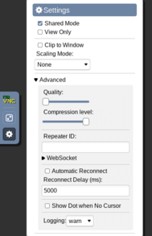

### **What is this?**
This is android-vnc, a repository for using android devices from another device on the same wifi network.
### **Disclaimer**
this will only work on a normal wifi network, not mobile data like 5G or 4G or anything
### **Prerequisites**
- First install [Termux](https://termux.com) from [F-Droid Download](https://f-droid.org/repo/com.termux_118.apk) (automatically starts download)
- Next install [DroidVNC-NG](https://github.com/bk138/droidVNC-NG) from [F-Droid Download](https://f-droid.org/repo/net.christianbeier.droidvnc_ng_18.apk) (automatically starts download)
### **Setup**
- Open DroidVNC-NG
- Set port to 5900
- Set a good password
- Make sure that start on boot is off
- Press start

##### It should look like:


- Open Termux
- Wait for any loading things go away
- Paste this command and press enter 
```bash
eval "$(echo 'confirm() { read -r -p "${1:-Please type '\''y'\'' and press enter anytime it stops and asks, Are you ready to Begin? [y/N]} " response; case "$response" in [yY][eE][sS]|[yY]) true;; *) false;; esac; }')"; cd .. && termux-change-repo && confirm && pkg update; pkg upgrade; pkg i python python-pip nodejs git wget curl iproute2; pkg i python-numpy; git clone https://github.com/novnc/noVNC; pip install websockify; x=$(ip -o -4 addr list wlan0 | awk '{print $4}' | cut -d/ -f1); echo "open this website on another device on the same wifi network: 'http://$x:6080/vnc.html'"; websockify --web ./noVNC/ 6080 ${x}:5900
```
- Follow given instructions in termux
You can now open the link it gave you on another device on the same wifi network then click connect, I recommend changing the settings to this:



### **How to turn it off?**
- Go to DroidVNC-NG
- Press the stop button
- Go to Termux
- Make sure keyboard is open
- Click the "CTRL" button above the keyboard
- Press "c" on your keyboard
- Drag open the bar at the top of your phone
- Expand the termux notification if there's an thing for it
- Press "Exit"
- Close the tab on the other device
- You are now free to exit and close the Termux and DroidVNC-NG apps
- It is now turned off
### **How to use again?**
- Open DroidVNC-NG
- Press start
- Open Termux
- Paste this command and press enter
```bash
x=$(ip -o -4 addr list wlan0 | awk '{print $4}' | cut -d/ -f1); echo "open this website on another device on the same wifi network: 'http://$x:6080/vnc.html'"; websockify --web ./noVNC/ 6080 ${x}:5900
```

### **If you found this repository useful please consider giving a star! Thank you for using this repository!😁**
